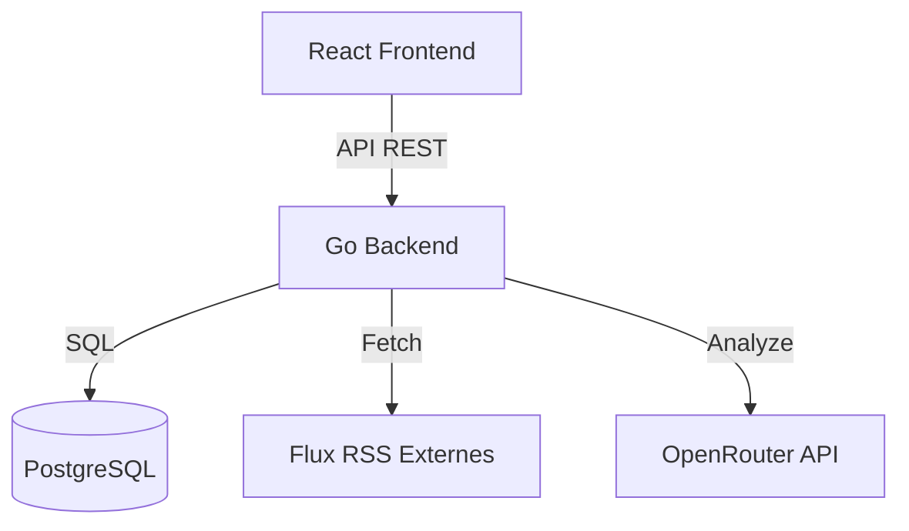

# 🌿 FlowReader

> **Le calme dans le chaos de l'information.**
> Un agrégateur RSS minimaliste, intelligent et économe, conçu pour ceux qui veulent reprendre le contrôle de leur veille.


[](https://golang.org/)
[](https://react.dev/)
[](https://www.docker.com/)
[](LICENSE)

## ✨ Pourquoi FlowReader ?

FlowReader n'est pas juste un autre lecteur RSS. C'est une expérience de lecture repensée pour l'efficacité et le plaisir. Fini le scroll infini anxiogène, place à la concentration.

### 🧘 Mode Focus

Une interface immersive inspirée des applications de rencontre pour trier vos flux à la vitesse de la pensée.

- **Swipe à droite :** Article lu / archivé.
- **Swipe à gauche :** Article gardé pour plus tard.
- **Double-clic :** Lecture immédiate.


### 🧠 Smart Digest (IA)

Ne perdez plus de temps sur les articles "clickbait".

- FlowReader utilise l'IA (via OpenRouter) pour lire le contenu complet à votre place.
- Il génère un **résumé concis** directement accessible depuis votre liste de lecture.
- Identifiez en un coup d'œil si un article mérite votre temps.


### ⚡ Performance & Sobriété

Conçu pour l'auto-hébergement respectueux des ressources.

- **Backend en Go :** Ultra-rapide et compilé.
- **Frontend React 19 :** Fluide et moderne.
- **< 150MB RAM :** Tourne parfaitement sur un Raspberry Pi ou un NAS modeste.

## 🚀 Fonctionnalités Clés

- **PWA & Offline :** Installez-le sur mobile comme une app native. Supporte la lecture hors-ligne.
- **Recherche Full-Text :** Retrouvez n'importe quel article instantanément grâce à l'indexation PostgreSQL.
- **Design Organique :** Thèmes "Organic Warmth" et "Deep Forest" (Mode Sombre) pour le confort des yeux.
- **Lecture Confortable :** Mode lecteur distration-free intégré.
- **Agents IA (BMad) :** Architecture conçue pour être maintenue et étendue par des agents IA.

## 📦 Installation

### Option 1 : Docker Compose (Recommandé)

Le moyen le plus simple de démarrer.

```bash
# 1. Cloner le dépôt
git clone https://github.com/R0m1k3/FlowReader.git
cd FlowReader

# 2. Lancer la stack
docker-compose up -d
```

Accédez à `http://localhost:8080`.

### Option 2 : Unraid

Un template dédié est fourni pour les utilisateurs d'Unraid.

1. Copiez le fichier `docker-compose.unraid.yaml` sur votre serveur.
2. Lancez le conteneur :

    ```bash
    docker-compose -f docker-compose.unraid.yaml up -d
    ```

    *Note : Les données sont persistées dans `/mnt/user/appdata/flowreader`.*

### Configuration (Variables d'Environnement)

| Variable | Description | Défaut |
|----------|-------------|--------|
| `PORT` | Port du serveur | `8080` |
| `DATABASE_URL` | Connexion PostgreSQL | `postgres://...` |
| `OPENROUTER_API_KEY` | Clé pour les résumés IA | *(Optionnel)* |

## 🛠️ Développement

Envie de mettre les mains dans le code ?

```bash
# Pré-requis : Go 1.22+, Node 20+, Docker

# 1. Lancer les services (DB)
make docker-up

# 2. Lancer le backend (avec reload)
make dev-backend

# 3. Lancer le frontend
make dev-frontend
```

## 🏗️ Architecture



## 🤝 Contribuer

Les contributions sont les bienvenues ! N'hésitez pas à ouvrir une Issue ou une Pull Request.

## 📄 Licence

Ce projet est sous licence MIT. Voir le fichier [LICENSE](LICENSE) pour plus de détails.
