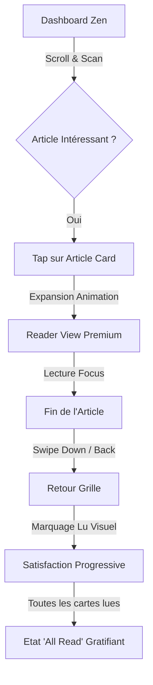
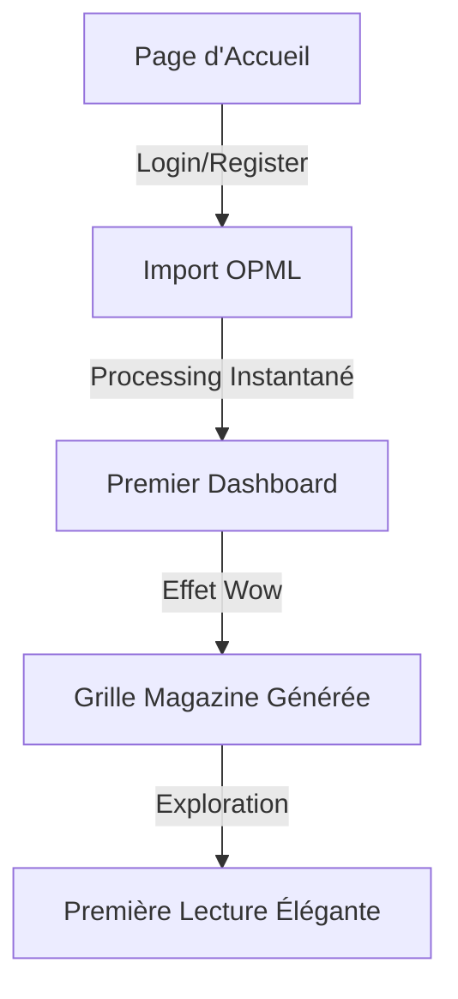
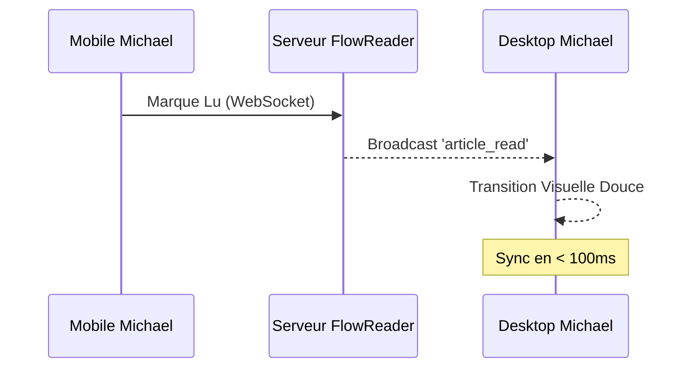

# UX Design Specification FlowReader

**Author:** Michael
**Date:** 2026-02-04

---

## Executive Summary

### Project Vision

FlowReader est conçu pour être un lecteur de flux RSS/Atom prônant la simplicité radicale et une expérience de lecture immersive ("Lecture Plaisir"). L'objectif est d'éliminer toute friction visuelle et technique pour se concentrer sur le contenu, tout en restant extrêmement performant (< 150Mo RAM).

### Target Users

- **Michael (Utilisateur Principal)** : Lecteur quotidien cherchant à rattraper son retard rapidement via un dashboard unifié sur mobile.
- **Paul (Nouvel Arrivant)** : Utilisateur cherchant une solution auto-hébergée simple à configurer via import OPML.

### Key Design Challenges

- **Fluidité Tactile** : Implémenter des interactions (swipe, transitions) fluides sans alourdir l'empreinte mémoire.
- **Uniformité Visuelle** : Transformer des flux RSS hétérogènes en un format de lecture "Livre" cohérent et épuré.
- **Efficience Mobile** : Optimiser l'interface pour une utilisation à une seule main avec des actions rapides.

### Design Opportunities

- **Typographie Premium** : Utiliser des polices et des espacements optimisés pour la lecture longue durée.
- **Feedback Gratifiant** : Intégrer des micro-animations subtiles pour les actions de marquage lu, renforçant le sentiment de progression.

## Core User Experience

### Defining Experience Detail

L'expérience cœur repose sur une vitesse de navigation absolue et une immersion totale. L'utilisateur doit pouvoir parcourir ses flux et entrer dans la lecture profonde sans aucune latence perçue ni distraction visuelle.

### Platform Strategy

- **Mobile-First** : Priorité au tactile, navigation par gestes (swipe) et ergonomie à une seule main.
- **Desktop Premium** : Layout en grille de cartes avec images centrées pour un aspect "Magazine" élégant, se distinguant des lecteurs RSS traditionnels.

### Effortless Interactions

- **Lecture Nettoyée** : Extraction et formatage automatique ("Livre") du contenu dès l'ouverture.
- **Marquage Lu Predictif** : Transitions fluides montrant l'état de l'article sans interrompre le flux de lecture.

### Critical Success Moments

- **Le Dashboard "Zen"** : Atterrir sur une interface propre qui donne envie de lire.
- **La Satisfaction du "Tout Lu"** : Un état final gratifiant visuellement.
- **Rendu Instantané** : Ouverture immédiate de l'article quel que soit le device.

### Experience Principles

- **Clarté Monacale** : Zéro distraction, focus sur le texte.
- **Vitesse Perçue** : Chaque interaction reçoit un feedback immédiat.
- **Impact Visuel** : Briser la monotonie par un design soigné et moderne.

## Desired Emotional Response

### Primary Emotional Goals

- **Calme & Focus** : Créer un sanctuaire de lecture loin du chaos des notifications et des réseaux sociaux.
- **Satisfaction** : Procurer un sentiment d'achèvement et de clarté mentale une fois les flux parcourus.

### Emotional Journey Mapping

- **Entrée** : Ouverture de l'app -> Sentiment de calme, dashboard ordonné.
- **Lecture** : Dans l'article -> Focus profond, immersion bibliographique ("Livre").
- **Sortie** : "Tout lu" -> Satisfaction du travail accompli, esprit libéré.

### Micro-Emotions

- **Confiance** : L'interface réagit exactement comme prévu, sans surprise technique.
- **Découverte** : Éveil de la curiosité grâce à une présentation visuelle élégante.

### Design Implications

- **Anti-Stress** : Pas de compteurs de non-lus en rouge anxiogène.
- **Minimalisme** : Réduction maximale du bruit visuel (icons, bordures, menus secondaires).

### Emotional Design Principles

- **Respect de l'Attention** : L'app s'efface devant le contenu.
- **Gratitude Gestuelle** : Les gestes tactiles doivent être doux et gratifiants visuellement.

## UX Pattern Analysis & Inspiration

### Inspiring Products Analysis

**Flipboard** est notre référence majeure pour son approche "Magazine Numérique".

- **Points Clefs** : Hiérarchie visuelle forte, utilisation de l'image comme point d'ancrage, interface immersive ("Full Screen").
- **Leçon** : Briser la monotonie des listes standard par une grille de cartes riche et aérée.

### Transferable UX Patterns

- **Cards Magazine** : Utiliser des cartes de tailles variables ou une grille ordonnée avec images centrées sur Desktop.
- **Hidden Controls** : Dissimuler les métadonnées et boutons secondaires derrière un geste ou une zone d'interaction secondaire.

### Anti-Patterns to Avoid

- **Navigation Complexité** : Éviter les gestes trop spécifiques (comme le "Flip" 3D) qui pourraient nuire à la performance ou à l'accessibilité.
- **Surcharge d'Onboarding** : Ne pas demander de choix complexes à l'utilisateur dès l'ouverture.

### Design Inspiration Strategy

Créer un **"Flip-Lite"** : L'élégance visuelle et la typographie haut de gamme d'un magazine imprimé, mais avec la réactivité et la légèreté d'une Single Page App optimisée.

## Design System Foundation

### Design System Choice

#### Custom Tailwind CSS v3

### Rationale for Selection

- **Performance Optimale** : Maîtrise totale du bundle CSS/JS pour respecter la contrainte de < 150Mo de RAM.
- **Fidélité au Design** : Liberté totale pour implémenter le layout "Magazine" sans les contraintes d'une bibliothèque de composants pré-stylés.
- **Expérience Développeur** : Tailwind est déjà intégré au projet, capitalisant sur l'existant.

### Implementation Approach

Utilisation de Tailwind pour définir un système de tokens (couleurs, typo, spacing) dans `tailwind.config.js` et création de composants React atomiques et fonctionnels.

### Customization Strategy

Focus sur une échelle typographique "Serif" pour le contenu des articles et "Sans-serif" pour l'interface UI, avec des grilles CSS dynamiques pour le layout Desktop par cartes.

## Core Experience Mechanics

### Defining Experience Detail Context

Un **"Magazine Instantané"** où chaque flux s'ouvre comme une page d'édition haut de gamme. L'interaction signature est l'expansion fluide de la carte vers la vue lecteur, garantissant une continuité visuelle sans rupture.

### User Mental Model

L'utilisateur perçoit FlowReader non pas comme un outil de gestion technique, mais comme une bibliothèque personnelle de contenus choisis. Chaque article ouvert est perçu comme une extension de la carte initiale.

### Success Criteria

- **Expansion Instantanée** : La transition entre la grille et l'article doit être fluide et durer moins de 300ms.
- **Lecture Focalisée** : Dès l'ouverture, seul le texte et les visuels cruciaux sont visibles.
- **Légèreté Visuelle** : L'interface doit paraître "respirer" grâce à des marges généreuses et un usage minimaliste des icônes.

### Novel UX Patterns

- **Animated Card Expansion** : Utilisation de transitions `Framer Motion` ou CSS ultra-légères pour animer l'élément de la carte vers le format plein écran.
- **Dynamic Centered Cards** : Grid Desktop Tailwind s'adaptant à l'aspect ratio des images de couverture pour conserver l'aspect magazine.

### Experience Mechanics Flow

1. **Initiation** : L'utilisateur effleure ou clique sur une carte dans la grille.
2. **Interaction** : La carte s'agrandit, l'image centrée devient l'en-tête de l'article, le texte s'écoule en dessous.
3. **Rétroaction** : Changement d'état visuel subtil des cartes déjà lues (opacité réduite, typo mutée).
4. **Complétion** : Un "Swipe down" ou le bouton retour referme l'article en le réduisant vers sa position initiale dans la grille.

## Visual Design Foundation

### Color System: "Paper Dark"

Une palette élégante et chaleureuse inspirée de l'édition premium en mode sombre.

- **Background** : `#1a1a1a` (Deep Carbon).
- **Surface** : `#262626` (Warm Charcoal).
- **Primary/Accent** : `#d4af37` (Soft Gold) ou `#eab308` (Saffron) pour les favoris et actions clés.
- **Text Primary** : `#e5e5e5` (Off-white) pour réduire la fatigue oculaire.
- **Text Secondary** : `#a3a3a3` (Muted Grey).

### Typography System

Un mariage entre modernité technique et tradition littéraire.

- **UI & Interface** : *Inter* (Sans-serif) - Clair, précis, moderne.
- **Contenu Articles** : *Lora* ou *Merriweather* (Serif) - Excellente lisibilité pour les longs textes, apporte le côté "Livre".
- **Titres Cards** : *Playfair Display* (Serif) - Pour l'impact visuel "Magazine".

### Spacing & Layout Foundation

- **Base Grid** : Système de 8px pour une cohérence parfaite.
- **Densité** : "Airy & Spacious". Marges généreuses (gap de 2rem minimum on desktop) pour laisser le contenu respirer.
- **Cards Desktop** : Grille asymétrique ou centrée avec images de couverture occupant ~40% de la hauteur de la carte.

### Accessibility Considerations

- **Contraste** : Respect strict des ratios WCAG AA pour le texte (`#e5e5e5` on `#1a1a1a`).
- **Target Sizes** : Zones de tap de 44px minimum sur mobile.
- **Focus States** : Bordures dorées (`#d4af37`) pour la navigation au clavier.

## Design Direction Decision

### Design Directions Context

Exploration d'un showcase interactif présentant des variations de cartes (Hero Image vs Typo Focused), de layouts (Grid vs List), et l'intégration des polices Serif pour le confort de lecture.

### Final Chosen Direction

**Magazine Premium "Paper Dark"**. Cette direction privilégie une grille de cartes riche avec des images de couverture fortes, une typographie contrastée mêlant Sans-serif pour l'UI et Serif pour le contenu, et un thème sombre chaleureux (Deep Carbon/Gold).

### Selection Rationale

Ce choix valide l'objectif de "Lecture Plaisir" en transformant des flux techniques en un objet éditorial élégant. Le système de cartes asymétriques brise la monotonie tout en restant performant et responsive.

### Technical Implementation

Utilisation de CSS Grid Tailwind pour le layout dynamique, Framer Motion (optionnel selon perf) pour l'expansion des cartes, et intégration des Google Fonts sélectionnées pour l'identité typographique.

## User Journey Flows

### 1. Le Rituel de Michael (Rattrapage Quotidien)

Ce parcours est optimisé pour la vitesse de lecture et la satisfaction visuelle.

### 2. L'Émerveillement de Paul (Onboarding Magique)

Paul doit transformer son chaos de flux en un magazine élégant en une seule étape.

### 3. Le Relais sans Couture (Sync Multi-Device)

Garantir que l'état de lecture est universel et sans friction latente.

### Journey Patterns Context

- **Pattern "Expansion/Collapse"** : Toutes les entrées et sorties de contenu utilisent le même modèle mental de zoom sur la carte.
- **Pattern "Feedback de Complétion"** : Chaque article lu est visuellement estompé dans la grille, renforçant le sentiment de progression.

### Flow Optimization Principles Detail

- **Zero-Latency** : Les actions de marquage lu sont optimistes dans l'UI (feedback immédiat avant réponse serveur).
- **Focus Unitaire** : Une seule action majeure par écran pour réduire la charge cognitive et respecter la "Clarté Monacale".

## Component Strategy

### Design System Components Detail

L'utilisation de **Tailwind CSS v3** permet d'utiliser les fondations suivantes :

- **Layout** : Grilles CSS dynamiques (`grid-cols`), conteneurs `prose` customisés.
- **Bases** : Boutons, formulaires d'import, navigation sidebar.
- **Feedback** : Notifications WebSocket (Toast alerts légères).

### Custom Components Detail

#### La Carte "Edition"

- **Purpose** : Afficher un article dans la grille avec un impact éditorial fort.
- **Anatomy** : Box container, Cover Image (centrée ou hero), Title (Playfair Display), Feed Source (Inter uppercase), Date/Read Time.
- **States** : Default, Hover (subtile élévation), Read (opacité réduite, texte muté).

#### Le "Livre" (Reader View)

- **Purpose** : Vue immersive plein écran pour la lecture profonde.
- **Anatomy** : Header large avec image, Titre Serif (italique possible), Corps de texte centré (max-width 65ch), Actions de bas d'article (Favorite, Share).
- **Accessibility** : Navigation clavier complète, contrastes WCAG AA.

#### Le Dashboard "Zen"

- **Purpose** : Organisation spatiale des cartes.
- **Usage** : Grille asymétrique simulant une mise en page magazine, s'adaptant à la taille d'écran.

### Component Implementation Strategy Detail

Les composants seront construits comme des fonctions React atomiques. Le style sera géré via des classes Tailwind pour éviter toute latence d'injection CSS. L'animation d'expansion sera implémentée en priorité via des transitions CSS natives pour minimiser l'usage de RAM.

### Implementation Roadmap Detail

1. **Phase 1 : Cœur Visuel** : Développement de la Carte et du Reader View.
2. **Phase 2 : Navigation & Layout** : Dashboard asymétrique et Sidebar.
3. **Phase 3 : Polissage** : Animations de transition et micro-feedbacks.

## UX Consistency Patterns

### Button Hierarchy

- **Primaire (Or)** : Actions transformatrices (Lire, Marquer tout lu). Style : Fond Or (`#d4af37`), texte sombre.
- **Secondaire (Warm Charcoal)** : Actions de gestion (Favoris, Partager). Style : Bordure Or, fond sombre (`#262626`).
- **Tertiaire (Ghost)** : Actions de navigation/système (Paramètres, Import). Style : Texte gris neutre, pas de fond.

### Feedback Patterns

- **Action Optimiste** : L'état visuel (ex: icône 'lu') change instantanément dans l'UI, avant la confirmation serveur.
- **WebSocket Broadcast** : Feedback subtil (changement d'opacité de la carte) lors d'une mise à jour depuis un autre terminal, sans interrompre la lecture en cours.

### Navigation Patterns

- **Seamless Grid-to-Reader** : Expansion centrée. L'utilisateur ne perd jamais le contexte visuel de la source de l'information.
- **Swipe-to-Go-Back** : Sur mobile, un geste de swipe vers le bas ou vers la gauche permet de fermer le lecteur et retrouver la grille.

### Zen States (Empty States)

- **Etat "Tout Lu"** : Message de gratification ("Votre esprit est libre"), accompagné d'un visuel minimaliste ou d'une citation inspirante pour marquer la fin de la séance de rattrapage.

### Loading Patterns

- **Skeleton Cards** : Chargement asynchrone des cartes utilisant des blocs de couleur respectant les `aspect-ratio` pour éviter tout saut de layout ("layout shift") pendant l'injection des images.

## Responsive Design & Accessibility

### Responsive Strategy

L'expérience FlowReader s'adapte pour garantir le confort de lecture sur tous les supports, en privilégiant une approche **Mobile-First** pour l'interaction et **Desktop Premium** pour la mise en page.

- **Mobile** : Priorité à l'utilisation à une seule main. Les contrôles sont placés en bas (Bottom Nav). Navigation par gestes (*Swipe down*) pour quitter la lecture.
- **Tablette** : Passage à une grille à 2 colonnes asymétriques. Optimisation des zones de tap pour le tactile.
- **Desktop** : Grille magazine large avec marges généreuses (2rem+). Menu latéral escamotable pour maximiser l'espace dédié au contenu.

### Breakpoint Strategy

Utilisation des breakpoints standard de Tailwind pour une compatibilité maximale :

- **Mobile** : `< 768px` (Sm/Md) - Layout 1 colonne.
- **Tablette** : `768px - 1024px` (Lg) - Layout 2 colonnes.
- **Desktop** : `> 1024px` (Xl/2Xl) - Layout multi-colonnes aéré.

### Accessibility Strategy

**Niveau WCAG AA** visé pour l'ensemble de l'interface.

- **Contrastes** : Vérification systématique des ratios pour le texte (`#e5e5e5` sur `#1a1a1a`).
- **Typographie** : Tailles de police généreuses (min 16px sur mobile, 18px-20px sur desktop pour le corps de texte).
- **Navigation Clavier** : Focus states hautement visibles avec halos dorés (`box-shadow: 0 0 10px #d4af37`).
- **Touch Targets** : Zones d'interaction de 44x44px minimum.

### Testing Strategy

- **Audit Automatisé** : Utilisation d'outils type Lighthouse/Axe pour détecter les erreurs de contraste et de structure ARIA.
- **Audit Manuel** : Test de navigation complète au clavier et vérification du rendu sur terminaux réels (iOS/Android).

### Implementation Guidelines

- **Semantic HTML** : Utilisation stricte des balises `<article>`, `<header>`, `<nav>`, `<footer>`.
- **CSS Clamp** : Utilisation de `clamp()` pour une typographie fluide qui s'adapte sans paliers brusques.
- **Optimistic UI** : Réduction de la latence perçue pour améliorer l'expérience des utilisateurs sur réseaux mobiles lents.

<!-- UX design content will be appended sequentially through collaborative workflow steps -->
